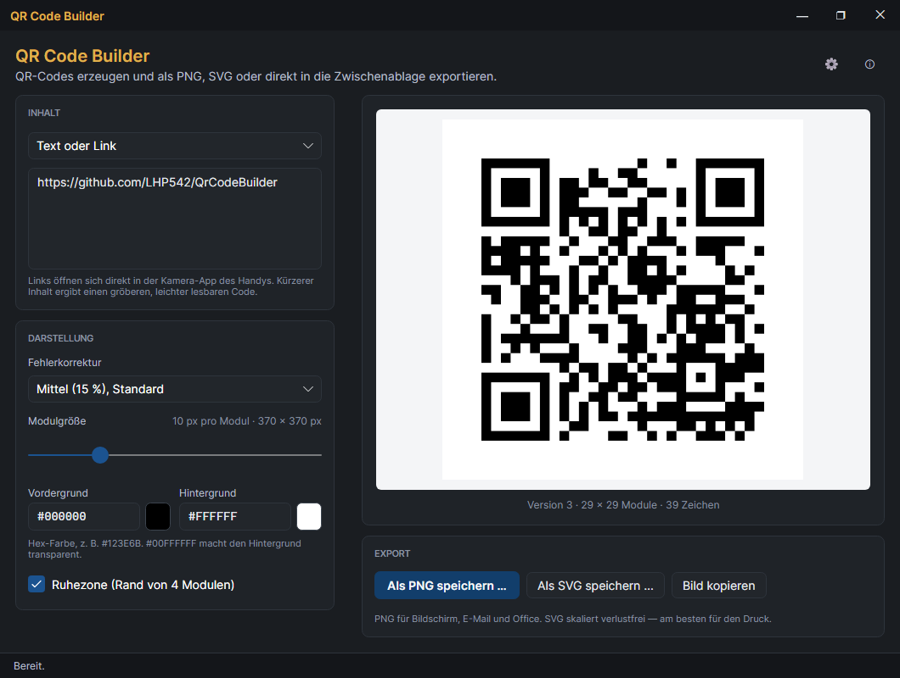
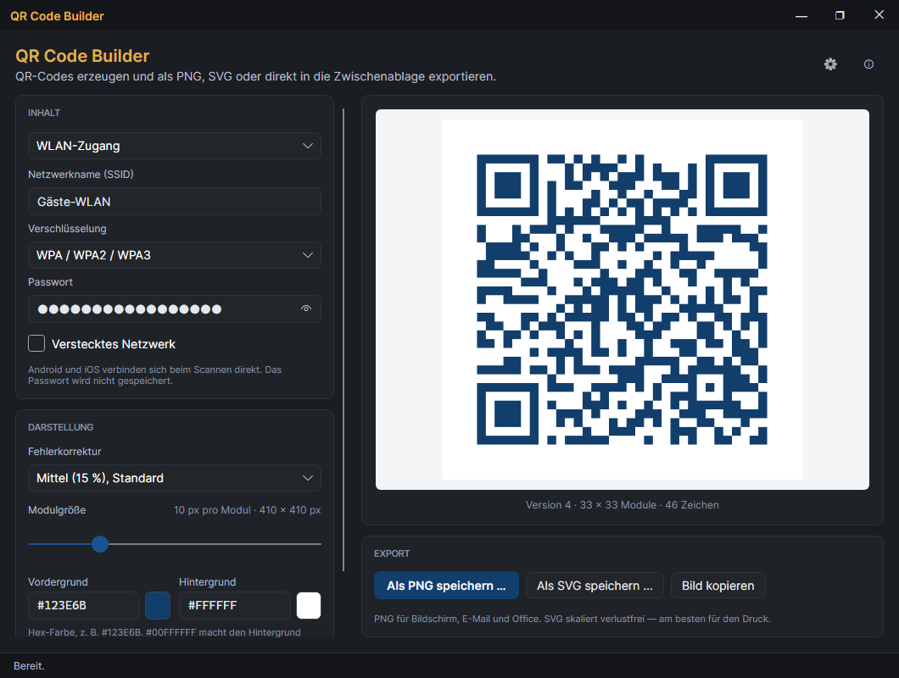
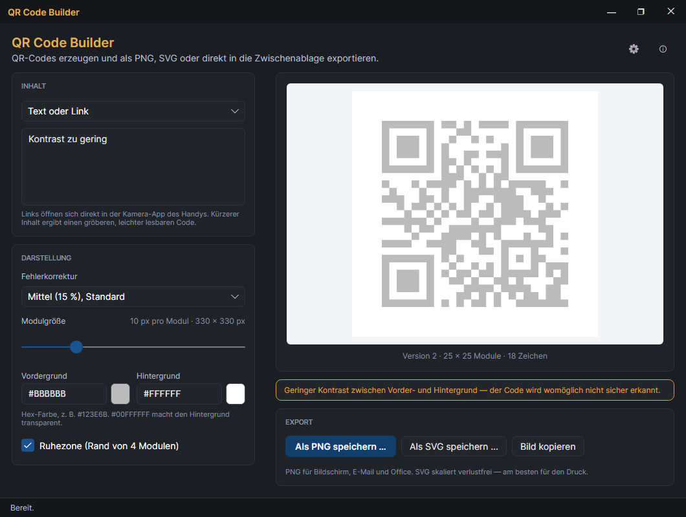
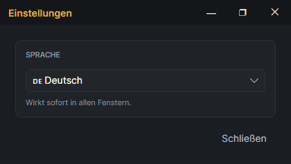
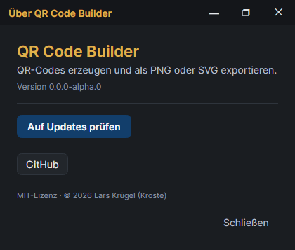

# QR Code Builder

[](https://github.com/LHP542/QrCodeBuilder/actions/workflows/ci.yml)
[](https://github.com/LHP542/QrCodeBuilder/releases)

QR-Codes für Links, Texte und WLAN-Zugänge erzeugen — und das Bild mit einem
Klick als **PNG**, als **SVG** oder direkt **in die Zwischenablage** weitergeben.
Für Windows und Linux, ohne Installation.



> Alle Bilder in dieser Datei zeigen **Beispieldaten**. Sie entstehen
> reproduzierbar aus dem Programm selbst — siehe [Bilder neu erzeugen](#bilder-neu-erzeugen).

## Auf einen Blick

- **Sofort-Vorschau:** Der Code entsteht beim Tippen. Es gibt keinen „Erzeugen"-Knopf,
  den man vergessen könnte.
- **Drei Wege nach draußen:** als PNG speichern, als SVG speichern oder als Bild
  kopieren und direkt in Word, Outlook, Teams oder PowerPoint einfügen.
- **WLAN-Zugang als Code:** Gäste scannen und sind verbunden — kein Passwort-Diktat.
- **Größe in Pixeln exakt wählbar**, eigene Farben, transparenter Hintergrund.
- **Warnt, bevor es peinlich wird:** zu wenig Kontrast, vertauschte Farben oder zu
  viel Text werden sofort angezeigt.
- **Merkt sich die Darstellung**, aber nie die Inhalte — Texte und Passwörter
  werden nicht gespeichert.
- Deutsch und Englisch, Umschaltung ohne Neustart.

## Installation

Fertige Pakete gibt es auf der [Releases-Seite](https://github.com/LHP542/QrCodeBuilder/releases).

**Windows:** `QrCodeBuilder-X.Y.Z-win-x64.zip` herunterladen, in einen beliebigen
Ordner entpacken und `QrCodeBuilder.exe` starten. Es wird nichts installiert und
keine Administratorberechtigung gebraucht.

**Linux (AppImage):** `QrCodeBuilder-X.Y.Z-x86_64.AppImage` herunterladen,
ausführbar machen und starten:

```bash
chmod +x QrCodeBuilder-*-x86_64.AppImage
./QrCodeBuilder-*-x86_64.AppImage
```

**Linux (tar.gz):** `QrCodeBuilder-X.Y.Z-linux-x64.tar.gz` entpacken und
`./QrCodeBuilder` starten.

## Bedienung

### 1. Inhalt eingeben

Oben links unter **INHALT** die Art wählen:

- **Text oder Link** — z. B. eine Webadresse für ein Plakat, eine Telefonnummer
  oder ein kurzer Hinweistext. Links öffnen sich beim Scannen direkt im Browser
  des Handys.
- **WLAN-Zugang** — Netzwerkname (SSID), Verschlüsselung und Passwort eintragen.
  Android und iOS verbinden sich beim Scannen mit der Kamera-App automatisch.
  Für ein offenes Netz „Keine" wählen, dann ist das Passwortfeld gesperrt.
  Das Augen-Symbol im Passwortfeld zeigt das Passwort zur Kontrolle an.



Unter der Vorschau steht, wie groß der Code geworden ist (Version, Anzahl der
Module, Zeichen). **Tipp:** Je kürzer der Inhalt, desto gröber der Code und desto
leichter lässt er sich aus der Entfernung oder von schlechtem Papier scannen.

### 2. Darstellung anpassen

Unter **DARSTELLUNG**:

| Einstellung | Wofür |
|---|---|
| **Fehlerkorrektur** | Wie viel vom Code beschädigt oder verdeckt sein darf, ohne dass er unlesbar wird. *Mittel* passt fast immer. *Sehr hoch* für Aushänge, die verschmutzen oder knicken können. Mehr Korrektur macht den Code dichter. |
| **Modulgröße** | Größe eines einzelnen Kästchens in Pixeln. Rechts daneben steht die fertige Bildgröße, z. B. „10 px pro Modul · 370 × 370 px". |
| **Vordergrund / Hintergrund** | Farben als Hex-Wert, z. B. `#123E6B` für Dunkelblau. Das Feld daneben zeigt die Farbe. `#00FFFFFF` macht den Hintergrund **transparent** — praktisch, wenn der Code auf ein farbiges Dokument soll. |
| **Ruhezone** | Der weiße Rand um den Code. Ohne ihn erkennen viele Scanner den Code schlecht — nur abschalten, wenn das Dokument selbst genug Rand lässt. |

Die gewählte Darstellung bleibt beim nächsten Start erhalten.

### 3. Exportieren

Unter **EXPORT**:

- **Als PNG speichern …** — für Bildschirm, E-Mail, Intranet und Office-Dokumente.
  Das Bild hat genau die angezeigte Pixelgröße.
- **Als SVG speichern …** — Vektorgrafik, lässt sich beliebig vergrößern ohne
  unscharf zu werden. **Die richtige Wahl für alles, was gedruckt wird** (Flyer,
  Plakate, Schilder) und für die Weitergabe an eine Druckerei.
- **Bild kopieren** — legt das PNG in die Zwischenablage. Danach im Zielprogramm
  einfach `Strg+V`.

Der Dateiname wird aus dem Inhalt vorgeschlagen, z. B. `qr-example.com-shop.png`.
Bei WLAN-Codes enthält er nur den Netzwerknamen — **das Passwort landet nie im
Dateinamen**. Die Statuszeile unten bestätigt, wohin gespeichert wurde.

### Hinweise in Orange

Passt etwas nicht, erscheint über dem Export ein orangefarbener Hinweis.
Exportieren lässt sich trotzdem — der Hinweis ist eine Warnung, kein Verbot:



| Hinweis | Was tun |
|---|---|
| *Geringer Kontrast …* | Dunkleren Vordergrund oder helleren Hintergrund wählen. |
| *Der Vordergrund ist heller als der Hintergrund …* | Farben tauschen — viele Scanner lesen helle Codes auf dunklem Grund nicht. |
| *Der Inhalt ist zu lang …* | Text kürzen (bei Links z. B. eine Kurz-URL) oder eine niedrigere Fehlerkorrektur wählen. |
| *ungültige Farbe* | Den Hex-Wert prüfen, erlaubt sind `#RGB`, `#RRGGBB` und `#AARRGGBB`. |

**Vor dem Druck immer einmal mit dem eigenen Handy testen** — besonders bei
eigenen Farben.

## Einstellungen

Das Zahnrad oben rechts öffnet die Einstellungen. Dort wird die **Sprache**
umgestellt (Deutsch/Englisch); die Umstellung wirkt sofort.



Das **ⓘ** daneben zeigt die Version und prüft auf Updates.

## Updates

Beim Start schaut das Programm im Hintergrund nach einer neueren Version. Gibt
es eine, fragt es nach — **ohne Zustimmung wird nichts installiert**. Nach
„Update installieren" lädt es die neue Version, ersetzt sich selbst und startet
neu. Manuell geht das über **ⓘ → Auf Updates prüfen**.



## Fenster und Infobereich

- **Minimieren** legt das Programm in den Infobereich (neben der Uhr). Ein Klick
  auf das Symbol holt es zurück; über das Kontextmenü lässt es sich beenden.
- **Schließen (✕)** beendet das Programm.
- Ein zweiter Start öffnet kein zweites Fenster, sondern holt das laufende nach vorn.

## Wo liegt was

| Was | Windows | Linux |
|---|---|---|
| Einstellungen | `%APPDATA%\QrCodeBuilder\settings.json` | `~/.config/QrCodeBuilder/settings.json` |
| Protokolle | `%LOCALAPPDATA%\QrCodeBuilder\logs\` | `~/.local/share/QrCodeBuilder/logs/` |

Die Protokolle werden 14 Tage aufbewahrt. Bei einem Problem bitte die aktuelle
Logdatei an ein Issue hängen — Passwörter und Tokens werden darin automatisch
unkenntlich gemacht. Der Inhalt eines QR-Codes steht nicht im Protokoll, nur
der Name der gespeicherten Datei.

## Entwicklung

```bash
dotnet build
dotnet test
dotnet run --project QrCodeBuilder
```

Release: VS-Code-Task „release (tag + push)" — prüft den Git-Zustand, setzt den
Tag und stößt die GitHub-Action an, die alle Pakete baut.

### Bilder neu erzeugen

Die Bilder in `docs/` rendert das Programm selbst (nur Debug-Build), mit
Beispieldaten und ohne die eigenen Einstellungen anzufassen:

```bash
dotnet run --project QrCodeBuilder -- --screenshots screenshots
```

Danach die deutschen Varianten (`main-text-de.png` → `hauptfenster.png`,
`main-wifi-de.png` → `wlan.png`, `main-warning-de.png` → `hinweis.png`,
`settings-de.png` → `einstellungen.png`, `about-de.png` → `ueber.png`) nach `docs/`
kopieren.

## Lizenz

MIT — siehe [LICENSE](LICENSE).
